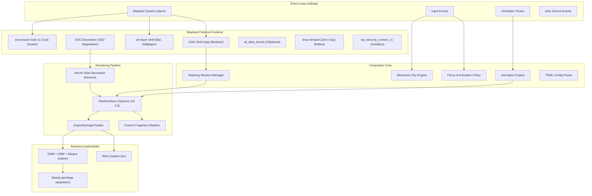

# Melt Desktop: Implementation Plan

Melt Desktop is a secure, simple, and visually appealing **stacking** Wayland desktop environment written in Rust using the [Smithay](https://github.com/Smithay/smithay) v0.7.0 library. This document is a verified, exhaustive blueprint for building the compositor from the ground up.

---

## 🏗️ Architecture Overview



---

## 🔒 Security Design (Verified)

Every security claim below has been validated against Wayland protocol specifications, published CVEs, and compositor source code.

### 1. Privilege Separation via `libseat`

| Detail | Value |
|---|---|
| **Smithay module** | `smithay::backend::session::libseat::LibSeatSession` |
| **Feature flags** | `backend_session`, `backend_session_libseat` |
| **Trusted code** | ~1000 lines (seatd daemon) |
| **Mechanism** | Compositor calls `libseat_open_device(path)` → seatd performs the privileged `open()` syscall → passes the FD back via IPC |

The compositor **never runs as root**. Device access (DRM GPUs, input devices) is brokered by `seatd` or `systemd-logind`, which verify the caller belongs to the active session. On VT switch, the seat manager **revokes** all device FDs.

### 2. Fail-Closed Screen Locking (`ext-session-lock-v1`)

| Detail | Value |
|---|---|
| **Smithay module** | `smithay::wayland::session_lock` |
| **Key types** | `SessionLockManagerState`, `SessionLockHandler`, `SessionLocker`, `LockSurface` |
| **CVE this prevents** | CVE-2022-26530 (swaylock fail-open bypass) |

**Critical design**: The compositor owns the lock state. If the lock client crashes, the session stays locked and all outputs are blanked. The `locked` event is NOT sent to the client until lock surfaces are presented on ALL outputs (preventing desktop flash). Input is inhibited to all non-lock clients while locked.

### 3. Focus-Restricted Clipboard

| Detail | Value |
|---|---|
| **Smithay module** | `smithay::wayland::selection::data_device` |
| **Protocol** | `wl_data_device` (core Wayland) |

Only the focused surface can set or read clipboard contents. Data is transferred via Unix pipes managed by the compositor — clients never connect directly. The privileged `wlr_data_control` protocol (for clipboard managers) will be filtered from sandboxed clients.

### 4. Global Filtering & Sandbox Integration

| Detail | Value |
|---|---|
| **Protocol** | `wp_security_context_v1` |

When Flatpak connects a sandboxed client, the compositor hides privileged globals from that client's `wl_registry`:
- `wlr_screencopy_manager` — prevents silent screen capture
- `zwlr_data_control_manager` — prevents clipboard spying
- `ext_session_lock_manager` — prevents lock hijacking
- `wlr_layer_shell` — prevents UI spoofing overlays

### 5. Portal-Brokered Screen Capture

Screen capture is **never** exposed directly to clients. Instead:
1. Client requests capture via `org.freedesktop.portal.ScreenCast` (D-Bus)
2. Portal backend shows a user-consent dialog
3. User selects which output/window to share
4. Frames are streamed via PipeWire — client receives a PipeWire node ID
5. Permissions are session-scoped (expire on restart)

### 6. Input Security

The compositor is the sole reader of `/dev/input/event*` via libinput. Key events are delivered ONLY to the focused `wl_surface`. There is no Wayland equivalent to X11's `XRecord` or `XGrabKeyboard`. Global hotkeys are handled via:
- Compositor-internal keybindings (never raw keys to clients)
- `org.freedesktop.portal.GlobalShortcuts` (app registers shortcuts; user approves via dialog; app receives activation signal, never raw key events)

### 7. XWayland Hardening (if enabled)

XWayland is the single biggest security gap in any Wayland session — X11 clients running under XWayland can spy on each other. Mitigations:
- Forward only modifier keys (Ctrl, Alt, Super) to XWayland — block alphanumeric keylogging (KWin approach)
- Mediate clipboard transfers between XWayland and native clients
- Mark XWayland as an optional, non-default feature

### 8. Protocol Input Validation

All client-provided data must be validated:
- Bounds-check buffer dimensions, coordinates, and enum values
- Reject out-of-order protocol state machine transitions
- Rate-limit protocol requests to prevent DoS (e.g., creating thousands of surfaces)

> [!CAUTION]
> **XWayland breaks the Wayland security model.** XWayland clients can keylog each other, scrape each other's windows, and manipulate each other's surfaces. Melt should ship with XWayland **disabled by default** and clearly warn users when they enable it.

---

## ✨ Aesthetics, Layout & Control

### Top-Mounted Status Bar

A unified bar anchored to the top of the screen displaying:
- **Left**: Application list / launcher (clickable, with mnemonic key underlines)
- **Center**: Workspace indicators
- **Right**: System clock, system tray indicators

Implementation: A separate `melt-panel` binary using `smithay-client-toolkit` + `wlr-layer-shell` protocol. The compositor's layer shell handler (`smithay::wayland::shell::wlr_layer`) maps it to the `Top` layer with exclusive zone reservation so maximized windows don't overlap it.

**Why a separate process?** Crash isolation — if the panel crashes, the compositor continues running and can restart the panel automatically. This is the pattern used by Sway/Waybar and recommended by all research.

### Default Dark Mode

- **Compositor UI** (SSD title bars, borders, panel): Deep charcoal (`#1e1e2e`) backgrounds, light gray (`#cdd6f4`) text, accent color (`#89b4fa`) for focused window borders.
- **Client applications**: Melt broadcasts the dark mode preference via XDG Desktop Portal D-Bus interface:
  - Path: `/org/freedesktop/portal/desktop`
  - Interface: `org.freedesktop.portal.Settings`
  - Key: `org.freedesktop.appearance` → `color-scheme` → `1` (prefer dark)
  - GTK, Qt, Firefox, Chromium all listen for this and switch themes automatically.

### Sharp Window Corners

Windows have crisp 90-degree corners with no rounding. The SSD renderer draws `SolidColorRenderElement` rectangles for borders and title bars — no corner-radius shader needed. This emphasizes structure and simplicity.

### Configurable Window Translucency

Per-window alpha compositing controlled by the compositor (there is no Wayland protocol for this):
- Store an `opacity: f32` field on each window in the stacking list
- Apply the opacity multiplier in a custom GLES texture shader using **premultiplied alpha** blending (`glBlendFunc(GL_ONE, GL_ONE_MINUS_SRC_ALPHA)`)
- Windows must be rendered back-to-front (alpha blending is order-dependent)
- Configurable via TOML `[[window_rules]]` by `app_id`

### Mnemonic Key Navigation

Compositor-level keyboard accelerators for mouse-free OS control:
- **Alt + underlined letter**: Activates menu items and panel actions
- **Super + number**: Switch to workspace N
- **Super + arrow keys**: Snap/tile focused window to screen halves
- **Alt + Tab**: Cycle through stacking order with a visual switcher overlay

Implementation: The compositor's input handler checks `xkb_state_mod_name_is_active(state, XKB_MOD_NAME_ALT)` to detect Alt state. When Alt is held, the panel enters "mnemonic mode" and renders underlines on shortcut characters. On Alt + letter press, the compositor matches `xkb_state_key_get_utf32()` against registered mnemonic bindings.

---

## 📦 Cargo.toml Feature Plan

```toml
[package]
name = "melt-desktop"
version = "0.1.0"
edition = "2021"

[dependencies]
smithay = { version = "0.7.0", default-features = false, features = [
    # Protocol frontend
    "wayland_frontend",
    "desktop",

    # Backends (nested dev)
    "backend_winit",

    # Backends (native TTY) — enabled via feature flag
    # "backend_drm",
    # "backend_gbm",
    # "backend_egl",
    # "backend_libinput",
    # "backend_session",
    # "backend_session_libseat",
    # "backend_udev",

    # Renderer
    "renderer_gl",
]}

# Event loop
calloop = "0.14"

# Logging
tracing = "0.1"
tracing-subscriber = { version = "0.3", features = ["env-filter"] }

# Configuration
serde = { version = "1.0", features = ["derive"] }
toml = "0.8"

# Utilities
bitflags = "2.2"

[features]
default = ["winit"]
winit = []
native = [
    "smithay/backend_drm",
    "smithay/backend_gbm",
    "smithay/backend_egl",
    "smithay/backend_libinput",
    "smithay/backend_session",
    "smithay/backend_session_libseat",
    "smithay/backend_udev",
]
xwayland = ["smithay/xwayland"]
```

---

## 📅 Phased Implementation Plan

### Phase 1: Stacking Window Manager Core

*Goal: A functional stacking compositor with proper window management.*

#### 1.1 — Stacking Order Engine
- [ ] Replace Smithay's default `Space` ordering with an explicit `Vec<Window>` stacking list where index = Z-order
- [ ] Implement `raise_window(window)` — moves window to top of stack, updates keyboard focus
- [ ] Implement `lower_window(window)` — moves window to bottom of stack
- [ ] Handle transient windows (dialogs) — always stack above their parent
- [ ] Implement fullscreen windows — exclusive Z-layer above all normal windows

#### 1.2 — Window Placement Policy
- [ ] **Cascade placement** (default): Each new window offset +30px right, +30px down from the previous
- [ ] **Center placement**: New windows centered on the active output
- [ ] Prevent windows from spawning entirely off-screen
- [ ] Respect size hints from XDG shell `set_min_size` / `set_max_size`

#### 1.3 — Focus & Activation Policy
- [ ] **Click-to-focus** (default): Pointer click focuses and raises the window
- [ ] Implement `XDG Activation` protocol (`smithay::wayland::xdg_activation`) to prevent focus stealing — apps must provide a valid activation token tied to user interaction
- [ ] Track keyboard focus separately from pointer focus
- [ ] On focus change, call `set_data_device_focus()` to update clipboard access

#### 1.4 — Interactive Pointer Grabs
- [ ] **Move grab**: Alt+click-drag anywhere on window to reposition (already scaffolded in `grabs/move_grab.rs`)
- [ ] **Resize grab**: Alt+right-click-drag to resize from nearest edge/corner (already scaffolded in `grabs/resize_grab.rs`)
- [ ] Clamp window position so at least 32px remains visible on-screen
- [ ] Visual resize feedback — update window geometry in real-time during drag

#### 1.5 — Multi-Output Support
- [ ] Handle output hotplug events (monitor connect/disconnect)
- [ ] Map new outputs with correct modes, transforms, and positions
- [ ] Move windows from disconnected outputs to remaining outputs
- [ ] Per-output workspace tracking

---

### Phase 2: Server-Side Decorations

*Goal: Draw title bars, borders, and window controls for all windows.*

#### 2.1 — XDG Decoration Negotiation
- [ ] Implement `XdgDecorationHandler` (`smithay::wayland::shell::xdg::decoration`)
- [ ] Always request `Mode::ServerSide` — Melt draws all decorations
- [ ] Fall back gracefully if client insists on CSD (respect but log warning)

#### 2.2 — Title Bar Rendering
- [ ] Create a `TitleBarElement` struct implementing `RenderElement`
- [ ] Render title bar as a `SolidColorRenderElement` rectangle (dark background: `#1e1e2e`)
- [ ] Render window title text (app name from `app_id` or `title`) — requires font rasterization
- [ ] Add dependency on a font rasterizer (e.g., `cosmic-text` or `fontdue`) for text rendering
- [ ] Cache rendered title text as a `TextureRenderElement` to avoid per-frame rasterization

#### 2.3 — Window Buttons
- [ ] Draw close (✕), maximize (▢), minimize (—) buttons as colored `SolidColorRenderElement` rectangles
- [ ] Handle pointer click on button regions — close sends `xdg_toplevel.close`, maximize toggles `set_maximized`
- [ ] Hover highlighting: change button color when pointer is over the button region

#### 2.4 — Border Rendering
- [ ] Render 1-2px borders around windows using `SolidColorRenderElement`
- [ ] **Active window**: accent color border (`#89b4fa`)
- [ ] **Inactive window**: dim border (`#45475a`)
- [ ] Sharp 90-degree corners — no rounding shader needed

#### 2.5 — Composited Element Assembly
- [ ] Use `render_elements!` macro to combine decoration elements with window surface elements:
  ```rust
  render_elements! {
      MeltRenderElement<R> where R: ImportMem;
      Surface = WaylandSurfaceRenderElement<R>,
      TitleBar = SolidColorRenderElement,
      Border = SolidColorRenderElement,
      Shadow = PixelShaderElement,
  }
  ```

---

### Phase 3: Security Hardening

*Goal: Lock down the compositor against all known attack vectors.*

#### 3.1 — Libseat Backend
- [ ] Add `native` feature flag that enables `backend_drm`, `backend_gbm`, `backend_egl`, `backend_libinput`, `backend_session`, `backend_session_libseat`, `backend_udev`
- [ ] Create `src/native.rs` backend module (parallel to existing `src/winit.rs`)
- [ ] Initialize `LibSeatSession::new()` — returns `(LibSeatSession, LibSeatSessionNotifier)`
- [ ] Insert `LibSeatSessionNotifier` into calloop for VT switch handling
- [ ] On session pause (VT switch away): drop renderer, release DRM master
- [ ] On session resume (VT switch back): re-acquire DRM master, re-initialize renderer

#### 3.2 — Session Lock
- [ ] Initialize `SessionLockManagerState::new::<MeltState, _>(&dh, |_| true)`
- [ ] Implement `SessionLockHandler`:
  - `lock()`: Transition compositor to locked state, blank all outputs, inhibit input to all non-lock surfaces. Call `confirmation.lock()` only after lock surfaces are rendered on ALL outputs.
  - `unlock()`: Remove lock surfaces, restore normal rendering
  - `new_surface()`: Map lock surface to the specified output
- [ ] **Fail-closed behavior**: If the lock client disconnects, keep the session locked and render solid black on all outputs
- [ ] Allow escape only via `loginctl unlock-session` or VT switch to login manager

#### 3.3 — Privileged Global Filtering
- [ ] Implement `wl_registry` global filtering based on client credentials
- [ ] Hide from sandboxed clients (`wp_security_context_v1`):
  - `zwlr_layer_shell_v1` (prevents UI spoofing overlays)
  - `zwlr_data_control_manager_v1` (prevents clipboard spying)
  - `ext_session_lock_manager_v1` (prevents lock hijacking)
  - `zwlr_screencopy_manager_v1` (prevents silent screen capture)
- [ ] Implement `wp_security_context_v1` handler for Flatpak integration

#### 3.4 — Input Validation & Rate Limiting
- [ ] Validate all client-provided buffer dimensions (reject 0-width, 0-height, or oversized)
- [ ] Validate XDG shell state transitions (e.g., don't allow `set_maximized` before first configure)
- [ ] Implement per-client surface creation rate limit (max 100 surfaces per client)
- [ ] Log protocol errors with client PID for forensics

#### 3.5 — Clipboard Hardening
- [ ] Verify `set_data_device_focus()` is called on every focus change (already in handlers)
- [ ] Restrict `wlr_data_control` access to trusted clipboard manager PIDs (configurable in TOML)
- [ ] Mediate XWayland clipboard transfers — only copy to native clipboard on explicit user paste action

---

### Phase 4: Visual Polish & Rendering

*Goal: Dark mode, translucency, shadows, and animations.*

#### 4.1 — Dark Theme System
- [ ] Define a `Theme` struct with named color slots:
  ```rust
  struct Theme {
      bg_primary: [f32; 4],      // #1e1e2e → [0.118, 0.118, 0.180, 1.0]
      bg_surface: [f32; 4],      // #313244
      text_primary: [f32; 4],    // #cdd6f4
      accent: [f32; 4],          // #89b4fa
      border_active: [f32; 4],   // #89b4fa
      border_inactive: [f32; 4], // #45475a
      shadow_color: [f32; 4],    // #000000 @ 40% alpha
  }
  ```
- [ ] Load theme from TOML config with Catppuccin Mocha as default
- [ ] Apply theme colors to all SSD elements, background clear color, and shadow shaders

#### 4.2 — Window Translucency
- [ ] Add `opacity: f32` field to the per-window state struct (default `1.0`)
- [ ] Compile a custom GLES texture shader via `GlesRenderer::compile_custom_texture_shader()`:
  ```glsl
  precision mediump float;
  varying vec2 v_texCoords;
  uniform sampler2D tex;
  uniform float alpha; // compositor-controlled opacity
  void main() {
      vec4 color = texture2D(tex, v_texCoords);
      gl_FragColor = color * alpha; // premultiplied alpha
  }
  ```
- [ ] Ensure back-to-front rendering order (alpha blending is order-dependent)
- [ ] Set `glBlendFunc(GL_ONE, GL_ONE_MINUS_SRC_ALPHA)` for premultiplied alpha
- [ ] Configurable per-app via `[[window_rules]]` in TOML

#### 4.3 — Drop Shadows
- [ ] Compile a custom pixel shader via `GlesRenderer::compile_custom_pixel_shader()` for soft box shadows
- [ ] Shadow parameters: offset (0, 4px), blur radius (12px), spread (2px), color from theme
- [ ] Render shadow elements BEHIND each window in the stacking order
- [ ] Skip shadow rendering for fullscreen and maximized windows

#### 4.4 — Animation Engine
- [ ] Create an `Animation` struct:
  ```rust
  struct Animation {
      property: AnimatedProperty, // Opacity, Scale, Position
      start_value: f64,
      target_value: f64,
      start_time: Instant,
      duration: Duration,
      easing: EasingCurve,
  }
  ```
- [ ] Implement easing functions: `ease_out_cubic`, `ease_out_expo`, `ease_in_out_quad`
- [ ] **Window open**: opacity 0→1, scale 0.95→1.0 over 150ms with `ease_out_cubic`
- [ ] **Window close**: Mark as "animating-out", keep surface alive. Opacity 1→0, scale 1.0→0.95 over 120ms. Destroy ONLY after animation completes.
- [ ] **Window maximize/restore**: Position and size interpolation over 200ms
- [ ] **Workspace switch**: Slide all windows left/right over 250ms with `ease_out_expo`
- [ ] Use `calloop` timer source to request redraws every ~16ms during active animations (60fps)
- [ ] Configurable durations and toggle in TOML (`[animations]` section)

---

### Phase 5: Shell Integration & Top Bar

*Goal: A usable desktop with a panel, app launcher, and system indicators.*

#### 5.1 — Layer Shell Protocol Handler
- [ ] Initialize `WlrLayerShellState::new::<MeltState>(&dh)`
- [ ] Implement `WlrLayerShellHandler`:
  - `new_layer_surface()`: Map surface to the correct layer and output
  - Handle `set_anchor`, `set_exclusive_zone`, `set_margin`
- [ ] Integrate `LayerMap` from `smithay::desktop` for per-output layer surface management
- [ ] Render layer surfaces in correct order: Background → Bottom → (Windows) → Top → Overlay
- [ ] **Security**: Restrict `wlr_layer_shell` access — only allow trusted clients (checked via PID or security context)

#### 5.2 — Reference Panel (`melt-panel`)
- [ ] Create a separate binary crate: `melt-panel/`
- [ ] Use `smithay-client-toolkit` for Wayland client-side layer shell
- [ ] Anchor to `Top | Left | Right` with exclusive zone = bar height (32px)
- [ ] **Left section**: Application menu with mnemonic underlines (e.g., `_File`, `_Terminal`, `_Browser`)
- [ ] **Center section**: Workspace indicator buttons (1-9)
- [ ] **Right section**: System clock (updated every second via timer), battery/network indicators
- [ ] Render using `tiny-skia` or `cosmic-text` for 2D drawing
- [ ] Dark theme matching the compositor theme colors
- [ ] IPC between compositor and panel via a custom Wayland protocol or Unix socket for:
  - Active window title updates
  - Workspace change notifications
  - Mnemonic activation triggers

#### 5.3 — Application Launcher
- [ ] Scan `.desktop` files from XDG data dirs for app list
- [ ] Sort by usage frequency (track launches in a local state file)
- [ ] Overlay launcher window (layer shell `Overlay` layer) triggered by Super key
- [ ] Fuzzy-search text input to filter applications
- [ ] Launch selected application as a child process with `WAYLAND_DISPLAY` set

---

### Phase 6: Mnemonic Key System & Keybindings

*Goal: Full keyboard-driven OS control.*

#### 6.1 — Keybinding Engine
- [ ] Parse keybindings from TOML `[keybindings]` section
- [ ] Map string representations (e.g., `"Alt+q"`) to xkbcommon keysym + modifier combinations
- [ ] Intercept bound keys in the compositor's input handler BEFORE forwarding to clients
- [ ] Built-in default bindings:

| Binding | Action |
|---|---|
| `Super + Return` | Spawn terminal |
| `Super + Q` | Close focused window |
| `Alt + F4` | Close focused window |
| `Alt + Tab` | Cycle window focus (forward) |
| `Alt + Shift + Tab` | Cycle window focus (backward) |
| `Super + 1-9` | Switch to workspace N |
| `Super + Shift + 1-9` | Move focused window to workspace N |
| `Super + Left/Right` | Snap window to left/right half |
| `Super + Up` | Maximize window |
| `Super + Down` | Restore / minimize window |
| `Super + L` | Lock session |
| `Super + Space` | Open app launcher |
| `Alt + F2` | Command runner |

#### 6.2 — Mnemonic Mode
- [ ] Detect Alt key state via `xkb_state_mod_name_is_active(state, XKB_MOD_NAME_ALT, XKB_STATE_MODS_EFFECTIVE)`
- [ ] When Alt is pressed alone (no other key), enter "mnemonic mode":
  - Send signal to panel to render underlines on mnemonic characters
  - Render mnemonic hints on SSD title bar menus
- [ ] On Alt + letter: match `xkb_state_key_get_utf32()` against registered mnemonics
- [ ] Execute the matched action (open menu, activate panel item, etc.)
- [ ] Exit mnemonic mode on Alt release or after action execution

#### 6.3 — Window Switcher Overlay
- [ ] `Alt + Tab` triggers a visual switcher overlay (rendered as a compositor-internal surface)
- [ ] Show window thumbnails in stacking order with app names
- [ ] Each entry has a mnemonic number (1-9) for direct selection
- [ ] Release Alt to confirm selection; Escape to cancel

---

### Phase 7: Configuration System

*Goal: User-customizable settings with sensible defaults.*

#### 7.1 — TOML Config Parser
- [ ] Read from `$XDG_CONFIG_HOME/melt/config.toml` (default: `~/.config/melt/config.toml`)
- [ ] Create config directory and write default config if missing
- [ ] All fields optional with `#[serde(default)]` — compositor works with zero config

#### 7.2 — Config Schema
```toml
[general]
terminal = "foot"                    # Default terminal emulator
focus_policy = "click"               # "click" | "follow_mouse" | "sloppy"
cursor_theme = "default"
cursor_size = 24
xwayland = false                     # Disabled by default for security

[appearance]
dark_mode = true
theme = "catppuccin-mocha"           # Built-in theme name or custom colors
border_width = 2
title_bar_height = 30
shadow_enabled = true
shadow_radius = 12
shadow_opacity = 0.4

[appearance.colors]                  # Override individual theme colors
bg_primary = "#1e1e2e"
accent = "#89b4fa"
text = "#cdd6f4"
border_active = "#89b4fa"
border_inactive = "#45475a"

[animations]
enabled = true
window_open_duration_ms = 150
window_close_duration_ms = 120
workspace_switch_duration_ms = 250
easing = "ease-out-cubic"            # "linear" | "ease-out-cubic" | "ease-out-expo"

[keybindings]
"Super+Return" = "SpawnTerminal"
"Super+q" = "CloseWindow"
"Alt+Tab" = "CycleFocus"
"Super+l" = "LockSession"
"Super+Space" = "AppLauncher"
"Super+1" = "Workspace1"
"Super+Left" = "SnapLeft"
"Super+Right" = "SnapRight"

[[window_rules]]
app_id = "firefox"
opacity = 1.0
floating = false

[[window_rules]]
app_id = "pavucontrol"
floating = true
opacity = 0.95

[[window_rules]]
app_id = "Alacritty"
opacity = 0.90                       # Slightly translucent terminal

[security]
clipboard_manager_app_ids = ["wl-clipboard", "cliphist"]
layer_shell_allowed_app_ids = ["melt-panel", "mako", "waybar"]
```

#### 7.3 — Live Reload
- [ ] Watch config file for changes using the `notify` crate
- [ ] On file change, re-parse TOML and apply non-destructive changes (colors, keybindings, animation speeds)
- [ ] Changes requiring restart (backend, XWayland toggle) logged as warnings

---

### Phase 8: Portal Integration & Dark Mode Signaling

*Goal: Secure screen capture and system-wide dark mode preference.*

#### 8.1 — XDG Desktop Portal Backend
- [ ] Create a D-Bus service implementing `org.freedesktop.impl.portal.Settings`
- [ ] Respond to `Read("org.freedesktop.appearance", "color-scheme")` with value `1` (prefer dark) based on config
- [ ] Emit `SettingChanged` signal when user toggles dark/light mode
- [ ] GTK, Qt, Firefox, and Chromium will automatically switch themes

#### 8.2 — Screenshot Portal
- [ ] Implement `org.freedesktop.impl.portal.Screenshot`
- [ ] Show a user-consent overlay ("App X wants to take a screenshot. Allow?")
- [ ] On approval, capture current output via renderer and return the image via D-Bus

#### 8.3 — ScreenCast Portal
- [ ] Implement `org.freedesktop.impl.portal.ScreenCast`
- [ ] Show output/window selection dialog with user consent
- [ ] Stream frames to PipeWire — client receives PipeWire node ID
- [ ] Permissions are session-scoped (revoked on session end)

---

## 📁 Final Source Layout

```
Melt-dektop/
├── Cargo.toml
├── README.md
├── IMPLEMENTATION_PLAN.md
├── .cargo/
│   └── config.toml                  # Default target = aarch64-unknown-linux-gnu
├── src/
│   ├── main.rs                      # Entry point, backend selection
│   ├── state.rs                     # MeltState struct, Wayland listener init
│   ├── config.rs                    # TOML config parser + defaults
│   ├── theme.rs                     # Color theme definitions
│   ├── input.rs                     # Input event processing
│   ├── focus.rs                     # Focus policy engine
│   ├── mnemonics.rs                 # Mnemonic key matching engine
│   ├── animations.rs                # Animation state machine + easing
│   ├── stacking.rs                  # Stacking order management
│   ├── workspaces.rs                # Virtual workspace management
│   ├── winit.rs                     # Winit nested backend
│   ├── native.rs                    # DRM + libinput + libseat backend
│   ├── grabs/
│   │   ├── mod.rs
│   │   ├── move_grab.rs
│   │   └── resize_grab.rs
│   ├── handlers/
│   │   ├── mod.rs                   # Seat, data device, output handlers
│   │   ├── compositor.rs            # Surface commit handling
│   │   ├── xdg_shell.rs             # Window map/unmap/configure
│   │   ├── xdg_decoration.rs        # SSD negotiation
│   │   ├── layer_shell.rs           # Panel/overlay handling
│   │   └── session_lock.rs          # Lock screen handler
│   ├── decorations/
│   │   ├── mod.rs
│   │   ├── title_bar.rs             # Title bar RenderElement
│   │   ├── borders.rs               # Border RenderElement
│   │   ├── buttons.rs               # Close/max/min buttons
│   │   └── shadows.rs               # Shadow pixel shader
│   └── render/
│       ├── mod.rs
│       ├── elements.rs              # render_elements! macro assembly
│       └── shaders.rs               # Custom GLES shader compilation
├── melt-panel/                      # Separate panel binary
│   ├── Cargo.toml
│   └── src/
│       └── main.rs
└── resources/
    └── default_config.toml          # Shipped default configuration
```

---

## ⚠️ Known Risks & Mitigations

| Risk | Impact | Mitigation |
|---|---|---|
| XWayland security gap | X11 clients can spy on each other | Disabled by default; modifier-only key forwarding when enabled |
| Lock client OOM-killed | Session locked but screens blank; may require VT switch | Monitor lock client health; auto-restart with exponential backoff |
| Font rendering complexity | Text in SSD title bars requires a font rasterizer | Use `cosmic-text` (already Rust, battle-tested in COSMIC DE) |
| GPU driver bugs | GLES shader compilation failures on some hardware | Fallback to `PixmanRenderer` (software) if GL init fails |
| Layer shell abuse | Malicious client creates transparent fullscreen overlay for phishing | Restrict `wlr_layer_shell` to allowlisted `app_id`s in config |
| Config file corruption | Compositor fails to start | Validate TOML on load; fall back to compiled-in defaults on parse error |
